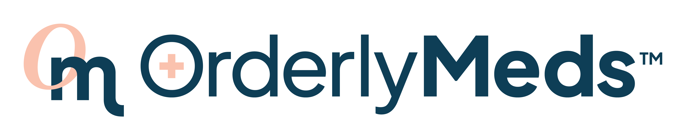

Orderly Wellness Corporation is a forward-thinking,
innovation-driven company committed to creating exceptional digital health experiences for our customers.
OrderlyMeds.com is our first product --
a telemedicine platform connecting US consumers
with a national network of providers and pharmacies
that provide prescription medical weight loss treatments.

## Open Roles

- [Engineering Manager](./roles/engineering_manager.md)

# Prior Roles

- [Fullstack Engineer](./roles/fullstack_engineer.md)
- [Senior Fullstack Engineer with UI/UX Focus](./roles/senior_fullstack_ui_ux.md)
- [Senior Fullstack Engineer with Data Focus](./roles/senior_fullstack_data.md)

## What we offer

- Flexible remote work environment
- Competitive salary and benefits package
- Equity in a fast-growing company with no VC funding dilution
- Professional development opportunities, including training and certifications
- A collaborative and inclusive work culture
- Opportunities to work on meaningful projects

## Company values

- Simply accessible
- Expertly reliable
- Go for delight
- All together now!

## What we value in Engineering

- Customer focus and maintaining empathy with our customers.
- Asynchronous communication by default with synchronous collaboration when needed.
- Over-communication and collaborative debugging
- Autonomy and action over consensus
- Ownership over the product and the work
- Collaboration and supporting team members
- Making work visible
- Iterating continuously

## Your peers would describe you as someone who

- Values transparency and open communication
- Dependable in meeting your commitments
- Able to work remotely - self-directed
- A self-starting problem solver - displays grit
- A lifelong learner with a growth mindset
- A positive contributor to company morale
- Strong opinions loosely held

## How we work

- Ideas and priorities flow from across the company.
- Big initiatives are planned into 4-8 week releases.
- Merged PRs auto-deploy to staging and production via chatops.
- Recorded work (shipped or WIP) demos are shared with the company.

## Upcoming projects

- New patient health screening workflow and integration with medical partners
- New patient portal for order tracking, payments, and user settings

## Our hiring process

- Apply via email
- 25-minute onboarding call with the hiring manager
- 90-minute asynchronous offline exercise
- 80-minute synchronous pair programming session
- 60-minute culture-fit interview
- 45-minute work history interview
- Offer letters concurrent with background checks
